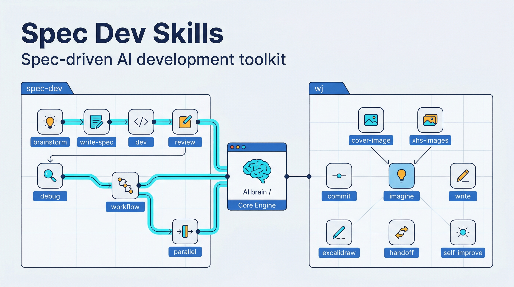

<div align="center">
  <h1>Spec Dev Skills</h1>
  <p><b>先写规格，再写代码。先达成共识，再动手实现。</b></p>
  <a href="https://github.com/wjgogogo/spec-dev-skills/stargazers"></a>
  <a href="LICENSE"></a>
</div>


## 为什么

由 AI 直接编写复杂功能时，很容易因为缺失全局视野或没有充分对齐目标，导致反复修改或南辕北辙。

本项目包含两套 Claude Code Skills，解决两类问题：

- **spec-dev** -- 规格驱动开发流程，强制引入一条轻量级的规范链条，让 AI 先想清楚再动手
- **wj** -- 日常工程效率工具，覆盖提交、写作、画图、生图、交接等高频场景
 


## Spec Dev Skills

基于 EARS 方法论的规格驱动开发流程：**澄清需求 -> 编写规格 -> 制定任务 -> 实现验证 -> 审查校验**。

| Skill                                               | 触发时机    | 做什么                                                         |
| :-------------------------------------------------- | :---------- | :------------------------------------------------------------- |
| [`/sd-brainstorm`](spec/skills/brainstorm/SKILL.md) | 动手之前    | 澄清目标、约束、边界和方案，范围过大时先拆出当前迭代要做的部分 |
| [`/sd-write-spec`](spec/skills/write-spec/SKILL.md) | 需求明确后  | 通过提问交流生成 EARS 需求文档，保存前做占位项、歧义和范围检查 |
| [`/sd-dev`](spec/skills/dev/SKILL.md)               | 规格完成后  | 根据需求文档生成可执行任务册，写明文件、验证命令和验证方式     |
| [`/sd-review`](spec/skills/review/SKILL.md)         | 实现完成后  | 对照需求文件和任务文件，多维度排查逻辑、规范和 Bug             |
| [`/sd-debug`](spec/skills/debug/SKILL.md)           | 遇到 Bug 时 | 系统化调试，先确认根因再修复                                   |
| [`/sd-workflow`](spec/skills/workflow/SKILL.md)     | 完整流程    | 串联 brainstorm -> spec -> dev -> review 的端到端工作流        |
| [`/sd-parallel`](spec/skills/parallel/SKILL.md)     | 多任务并行  | 协调多个开发任务的并行执行                                     |

## WJ Skills

日常工程效率工具集，8 个 skill 各司其职。

| Skill                                                 | 触发时机            | 做什么                                                             |
| :---------------------------------------------------- | :------------------ | :----------------------------------------------------------------- |
| [`/wj-commit`](wj/skills/commit/SKILL.md)             | 提交代码            | 标准化 Git 提交流程，生成 Conventional Commits 格式                |
| [`/wj-write`](wj/skills/write/SKILL.md)               | 润色文档            | 中文技术文档润色，修正排版，可选去 AI 腔和作者风格改写             |
| [`/wj-cover-image`](wj/skills/cover-image/SKILL.md)   | 生成封面图          | 5 维定制（type/palette/rendering/text/mood），支持风格预设和参考图 |
| [`/wj-xhs-images`](wj/skills/xhs-images/SKILL.md)     | 小红书图文 / 信息图 | XHS 模式生成 1-10 张系列图；Infographic 模式生成单张专业信息图     |
| [`/wj-imagine`](wj/skills/imagine/SKILL.md)           | 生成 AI 图片        | 底层生图引擎，支持批量并行、参考图、多种画质和宽高比               |
| [`/wj-excalidraw`](wj/skills/excalidraw/SKILL.md)     | 画技术图            | 生成手绘风格的 Excalidraw 技术示意图，4 种预设风格                 |
| [`/wj-handoff`](wj/skills/handoff/SKILL.md)           | 会话结束            | 生成结构化交接文档，为下一个 agent 或人类留下可继续的上下文        |
| [`/wj-self-improve`](wj/skills/self-improve/SKILL.md) | 沉淀项目规范        | 将反复出现的纠正沉淀为 CLAUDE.md 项目级规则                        |

生图类 skill 的关系：`wj-cover-image` 和 `wj-xhs-images` 是上层业务 skill，底层统一调用 `wj-imagine` 生成图片。

## 安装

**Claude Code：**

```bash
# 安装全部（spec-dev + wj）
/plugin marketplace add https://github.com/wjgogogo/spec-dev-skills.git

# 仅安装 spec-dev
/plugin marketplace add https://github.com/wjgogogo/spec-dev-skills.git --plugin spec-dev

# 仅安装 wj
/plugin marketplace add https://github.com/wjgogogo/spec-dev-skills.git --plugin wj

# 本地开发
claude --plugin-dir /path/to/spec-dev-skills
```

**Codex：**

```bash
# 复制粘贴给 codex
Fetch and follow instructions from https://raw.githubusercontent.com/wjgogogo/spec-dev-skills/main/.codex/INSTALL.md
```

## 设计理念

**Spec Dev** 的核心信念是：代码是需求的实现，不是需求本身。跳过规格直接写代码，就像不画图纸直接砌墙。EARS（Easy Approach to Requirements Syntax）提供了一套简洁的需求描述语法，让 AI 和人都能精确理解"要做什么"和"不做什么"。

**WJ Skills** 的设计原则：
- 每个 skill 只做一件事，触发条件明确
- 渐进式信息加载，SKILL.md 保持主干逻辑，细节按需从 references/ 读取
- 生图 skill 分层架构，业务逻辑与底层引擎分离
- 通过 EXTEND.md 偏好系统支持个性化配置，首次使用有引导设置

## Inspired By

- [Superpowers](https://github.com/obra/superpowers) -- 全面的 Claude Code skill 集合，展示了 skill 系统的可能性
- [Baoyu Skills](https://github.com/JimLiu/baoyu-skills) -- 宝玉的实用 skill 套件，在中文社区的实践经验
- [Impeccable](https://github.com/pbakaus/impeccable) -- 精致的工程习惯 skill，对质量和细节的追求

## License

MIT License.
